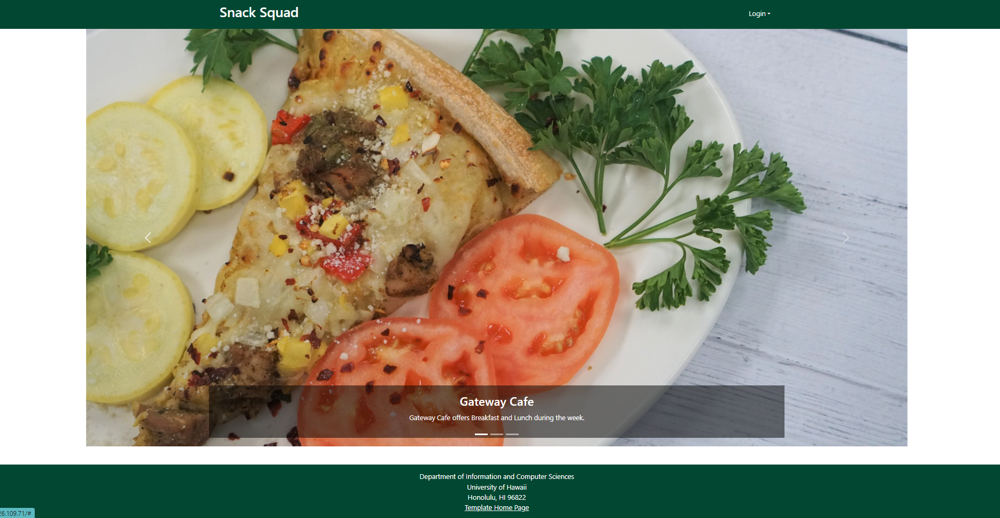
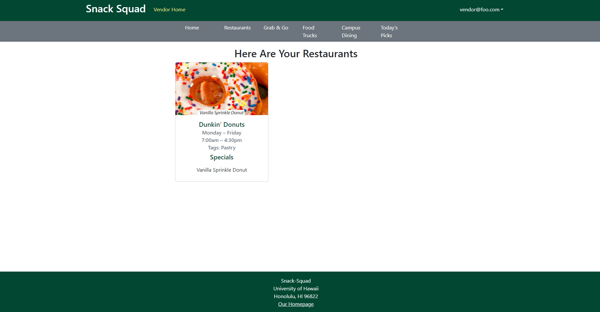
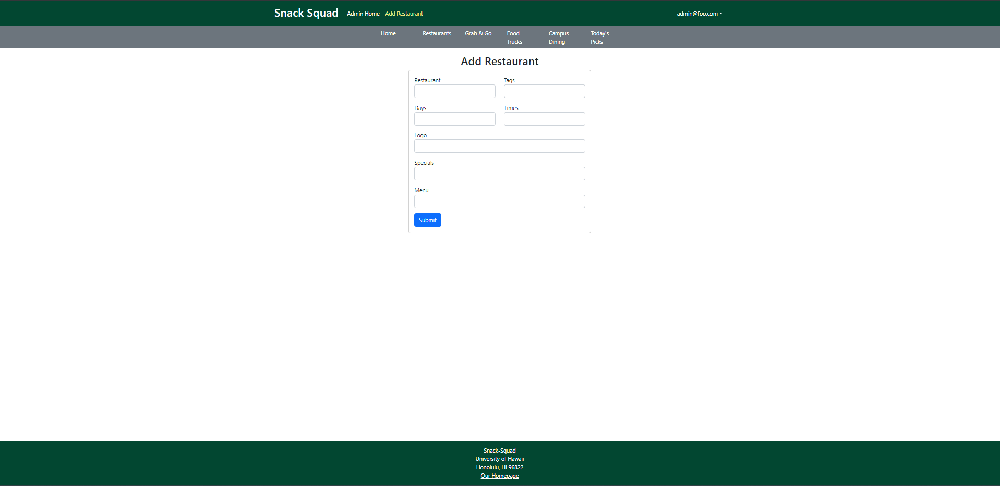
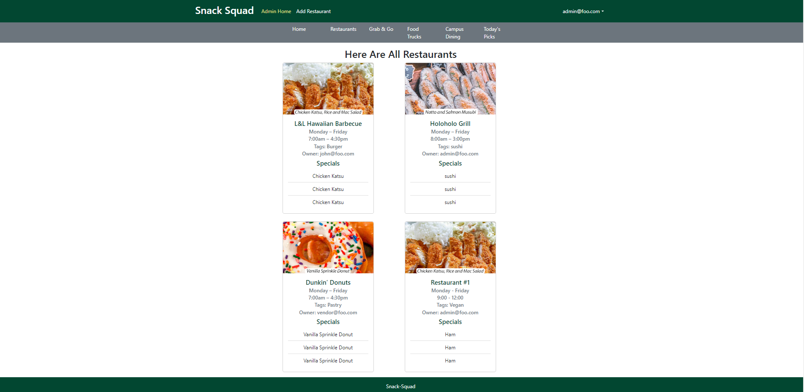
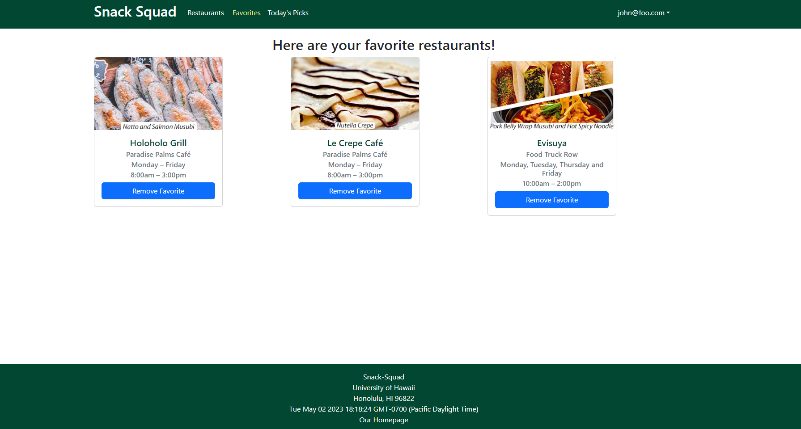
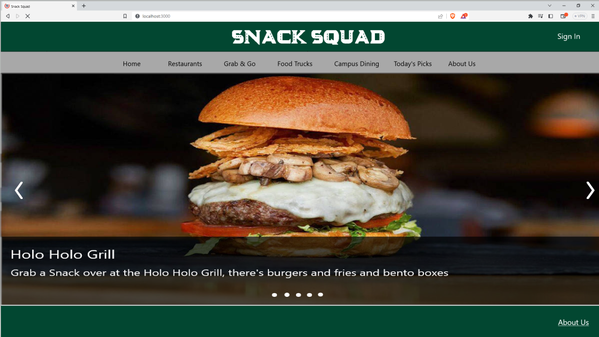
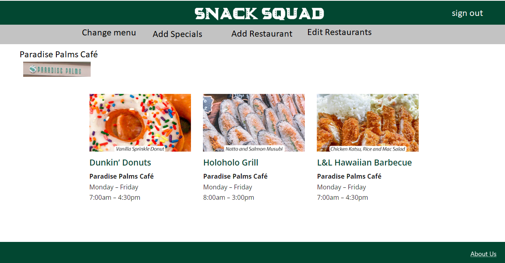
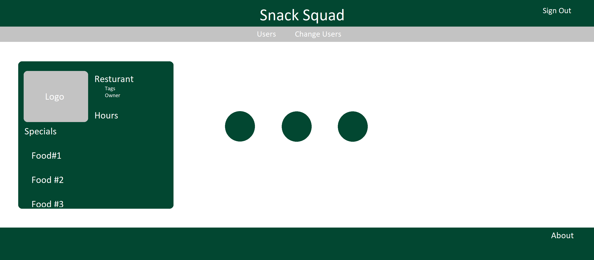

## Snack Squad

## Table of contents

* [Overview](#overview)
* [Features](#features)
* [Deployment](#deployment)
* [User Guide](#user-guide)
* [Members](#members)
* [Resources](#resources)

## Overview

Snack Squad is an organization of students aiming to create a website that is useful and applicable for the University of Hawaii at Manoa community. We are currently students at the University taking the ICS 314 course. The goal of this project is to create a website to present available menu items for all campus locations in a unified manner. This will be done by allowing vendors to establish menus and daily specials for users to sort through. Users will be able to set preferences that will allow them to filter their results based on their desires. 

## Planned Features

* Landing Page
* User Home Page
* Admin Home Page
* Vendor Home Page
* Add Vendor Page
* Today's Picks Page
* List Of Food Trucks
* List of Campus Dining Areas
* List of food you can just grab and go without the need to wait

## Beyond the Basics

* Ability for users who are logged in to filter food locations by preference for food, tags and whether they have favorited the place
* Ability to search for a food item via a sitewide searchbar

## Deployment

View our website [Snack Squad](https://snack-squad.online/)

## User Guide

### Current Landing page

Current running landing page.

### Current Vendor Home page

Current running vendor home page.

### Current Add Restaurant page

Current running add restaurant page.

### Current Admin Home page

Current running admin home page.

### Current User Home page

Current running user home page.

## Initial Mockups

### Landing Page

Mockup for our upcoming landing page.

### User Home Page

Template for our upcoming user home page.

### Vendor Home Page

Template for our upcoming vendor home page.

### Admin Home Page
Template for our upcoming admin home page.

### Members

<ul>
  <li>Dustin Tomi</li>
  <li>Nicolas Steger</li>
  <li>Payton Higa</li>
  <li>Raymond Lai</li>
</ul>

## Resources

View our team contract [here](https://docs.google.com/document/d/1sd9oMwB1Ag79HgdZCrIyNkRM-P1il__5RpOqxmauF3c/edit)

View our progress first milestone progress [M1](https://github.com/orgs/snack-squad/projects/1)

View our progress second milestone progress [M2](https://github.com/orgs/snack-squad/projects/3)

View our progress second milestone progress [M3](https://github.com/orgs/snack-squad/projects/4)

