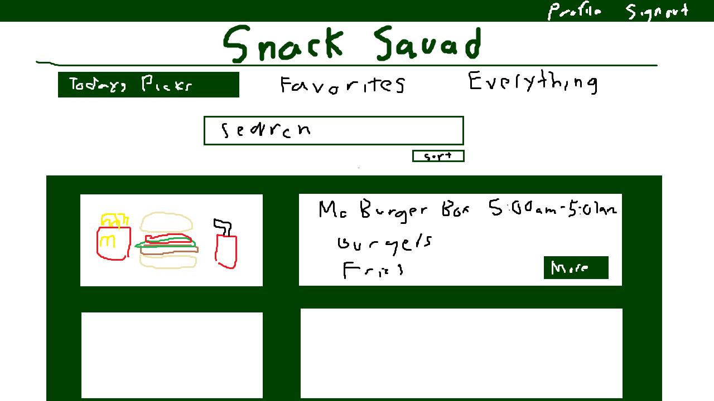
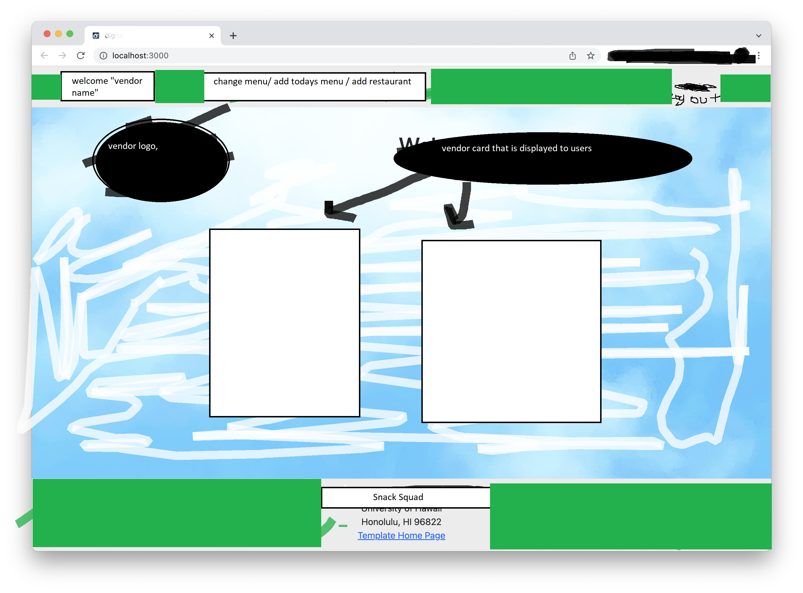

# Snack Squad

## Table of contents

* [Overview](#overview)
* [User Guide](#user-guide)
* [Members](#members)
* [Current Projects](#current-projects)

## Overview

Snack Squad is an organization of students that create websites and useful applications for the University of Hawaii at Manoa community. We are currently students at the University taking the ICS 314 course.

## User Guide

### User Home Page

Template for our upcoming user home page.

### Vendor Home Page

Template for our upcoming vendor home page.

### Members

<ul>
  <li>Dustin Tomi</li>
  <li>Nicolas Steger</li>
  <li>Payton Higa</li>
  <li>Raymond Lai</li>
</ul>

## Current Projects
<h2>Manoa Munchies</h2>

## Resources

View our team contract [here](https://docs.google.com/document/d/1sd9oMwB1Ag79HgdZCrIyNkRM-P1il__5RpOqxmauF3c/edit)

