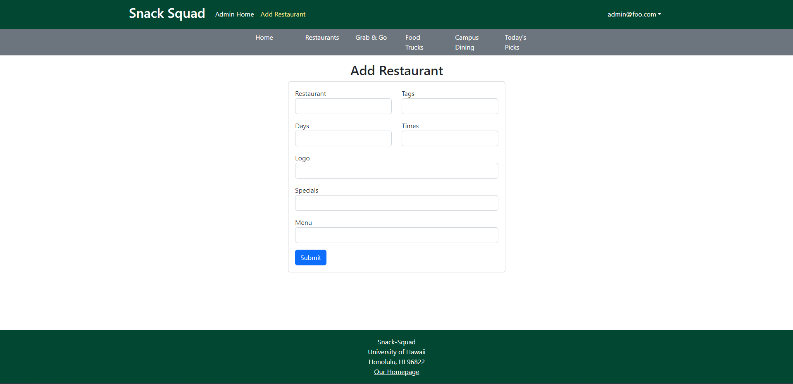

## Snack Squad

## Table of contents

* [Overview](#overview)
* [Features](#features)
* [Deployment](#deployment)
* [User Guide](#user-guide)
* [Members](#members)
* [Resources](#resources)

## Overview

Snack Squad is an organization of students aiming to create a website that is useful and applicable for the University of Hawaii at Manoa community. We are currently students at the University taking the ICS 314 course. The goal of this project is to create a website to present available menu items for all campus locations in a unified manner. This will be done by allowing vendors to establish menus and daily specials for users to sort through. Users will be able to set preferences that will allow them to filter their results based on their desires. 

## Current features

* Landing Page
* User Home Page
* Admin Home Page
* Vendor Home Page
* Add Vendor Page
* Today's Picks Page
* List Of Food Trucks
* List of Campus Dining Areas
* List of food you can just grab and go without the need to wait

## Beyond the Basics

* Ability for users who are logged in to filter food locations by preference for food, tags and whether they have favorited the place
* Ability to search for a food item via a sitewide searchbar

## Deployment

View our website [Snack Squad](https://snack-squad.online/)

## User Guide

### Current Landing page

Current running landing page.

### Current Vendor Home page

Current running vendor home page.

### Current Add Restaurant page

Current running add restaurant page.

### Current Edit Restaurant page

Current running Edit restaurant page.

### Current Admin Home page

Current running admin home page.

### Current User Home page

Current running user home page.

### Current Restaurant List

Current running list of restaurant pages.

## Initial Mockups

### Landing Page

Mockup for our upcoming landing page.

### User Home Page

Template for our upcoming user home page.

### Vendor Home Page

Template for our upcoming vendor home page.

### Admin Home Page
Template for our upcoming admin home page.

## Community Feedback

Isaac Demello: I found the Snack Squad website to be a great experience overall. The website has a well-designed interface with a functioning search bar that makes it easy to find what you're looking for. I also appreciated the favorites and unfavorite features, which allowed me to keep track of my preferred items easily. Additionally, the website was easy to navigate, and I didn't encounter any technical issues during my visit. They should design a logo and make the search function able to search by tags or a larger scope other than restaurant names. 

Chris Magallones: Snack Squad could consider adjusting the layout of the website to ensure that the restaurant listings are aligned more evenly some of the spacing is off. Overall, I appreciate how Snack Squad provides a convenient way to view all of the food options on campus in one place, and the "top picks" feature is helpful for discovering new menu items.

Andrew Hayashi: The website is very intuitive to use. I can find what restaurants are open right now, what food they are serving, and also some recommendations from the Today’s Picks web page. The ability to add, remove, and edit favorite restaurants runs very smoothly. Overall, I greatly enjoyed using this website.

Joshua Kobayashi: Overall website looks clean. I wish there were a logo in the top left to make it look better and add more liveliness to the page. There could be more features. I looked at the admin page, and editing and adding restaurants was streamlined, although I think there could be more set choices for some of the options so people can't mess up the input. 

Keith Maki: Snack Squad is a good website. The website is user-friendly and easy to navigate. It is easy to find things with the different sections such as restaurants, search and filter, and Today's Picks. You should add something to look for dietary restrictions since I am vegetarian.
## Developer Guide

### Members

<ul>
  <li>Dustin Tomi</li>
  <li>Nicolas Steger</li>
  <li>Payton Higa</li>
  <li>Raymond Lai</li>
</ul>

## Resources

View our team contract [here](https://docs.google.com/document/d/1sd9oMwB1Ag79HgdZCrIyNkRM-P1il__5RpOqxmauF3c/edit)

View our progress first milestone progress [M1](https://github.com/orgs/snack-squad/projects/1)

View our progress second milestone progress [M2](https://github.com/orgs/snack-squad/projects/3)

View our progress second milestone progress [M3](https://github.com/orgs/snack-squad/projects/4)

